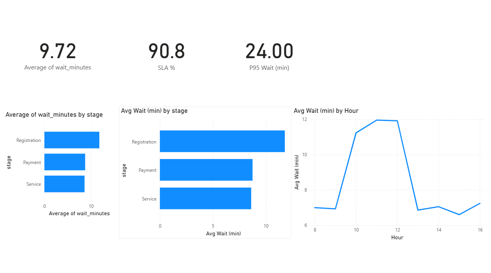
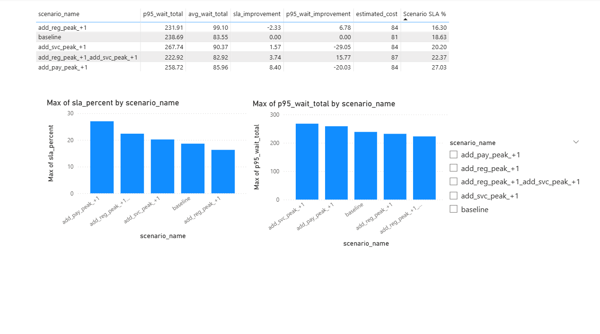

# Queue Ops Analytics + Discrete-Event Simulation (SimPy) | What-if Staffing

## Overview
This project analyzes waiting times in a multi-stage service process (e.g., **Bank / Hospital / Government Office**) and evaluates **peak-hour staffing “what-if” scenarios** using a **discrete-event simulation** built with **SimPy**.

It has two parts:
1. **Baseline Analytics (Power BI):** Identify bottlenecks, peak hours, and KPI performance.
2. **Simulation + Scenarios (SimPy):** Model the queue system and compare staffing changes using SLA%, P95 wait, and cost.

---

## Problem Statement
Service systems often suffer from long queues during peak hours. This project answers:
- Where is the **bottleneck stage** (Registration / Service / Payment)?
- Which **hours** create the worst waiting times?
- What staffing change improves **SLA** and reduces **worst-case waits (P95)** with minimal extra cost?

---

## Key Metrics
- **Avg Wait (min):** average waiting time
- **P95 Wait (min):** 95th percentile waiting time (tail / worst-case)
- **SLA %:** percentage meeting the rule: **Total wait ≤ 20 minutes**
- **Scenario comparison:** improvement vs baseline + estimated cost

---

## Dataset (Synthetic)
This project uses a **synthetic dataset** (`service_events.csv`) generated to mimic realistic queue behavior because real queue logs are often private.
The generator includes realistic patterns:
- Higher arrivals during **peak hours** (e.g., 10–12)
- Different service-time distributions per stage
- Priority customers and appointment vs walk-in behavior

> Note: The goal is to demonstrate the analytics + simulation methodology, not to claim real-world outcomes for a specific organization.

---

## Project Structure
```text
queue-sim-analytics/
  data/
    raw/
      service_events.csv
    processed/
      arrival_rates.csv
      sim_events_baseline.csv
      scenario_summary.csv
  simulation/
    config.py
    generate_data.py
    build_arrival_rates.py
    simulate.py
    scenarios.py
  dashboard/        # Put Power BI screenshots here
  report/
    insights.md     # Short findings + recommendation
  README.md
```


